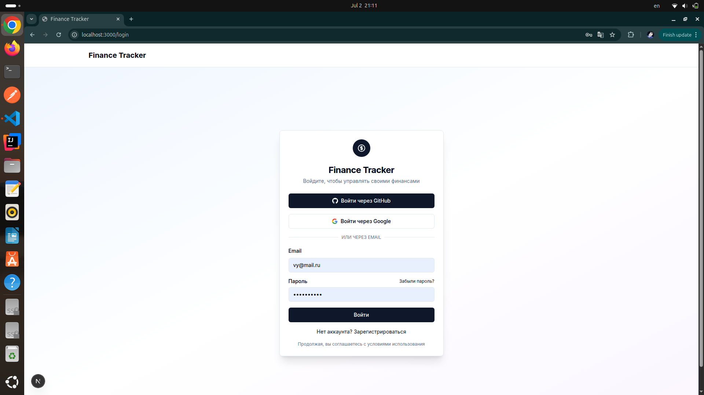
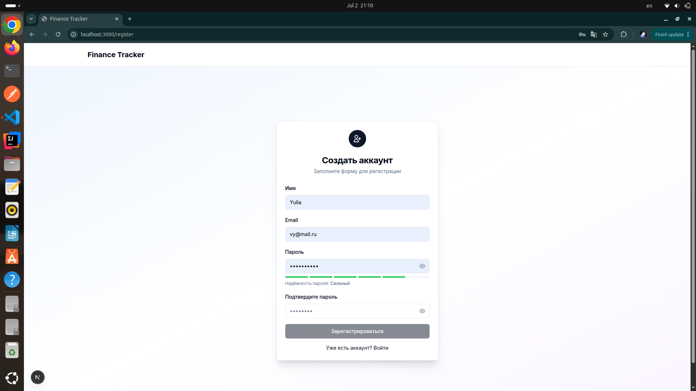
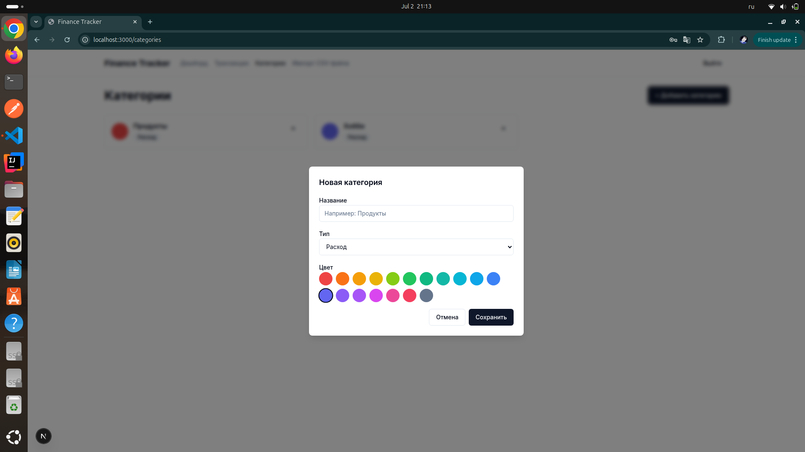
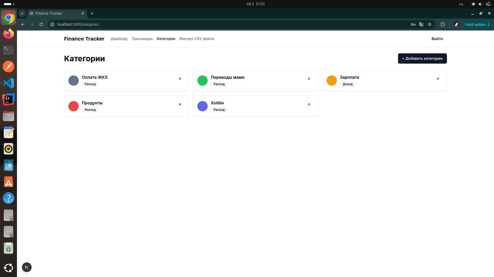
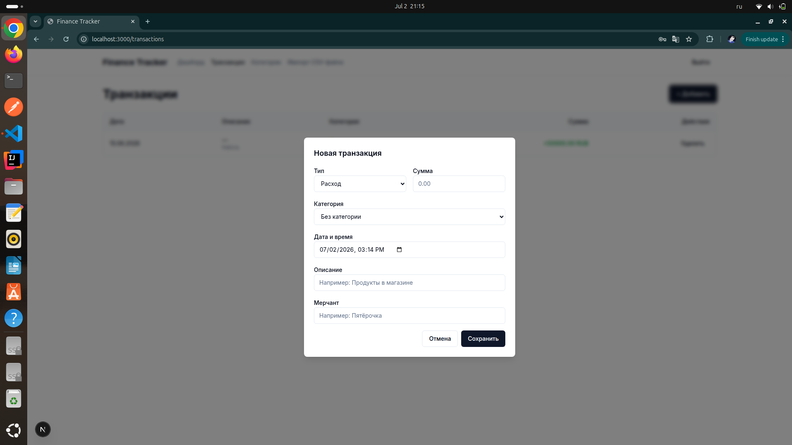
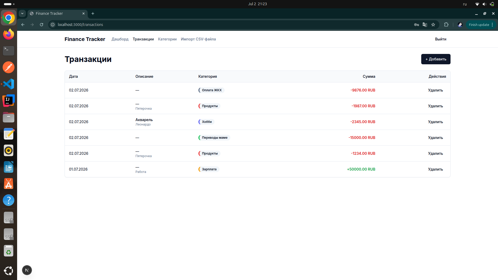
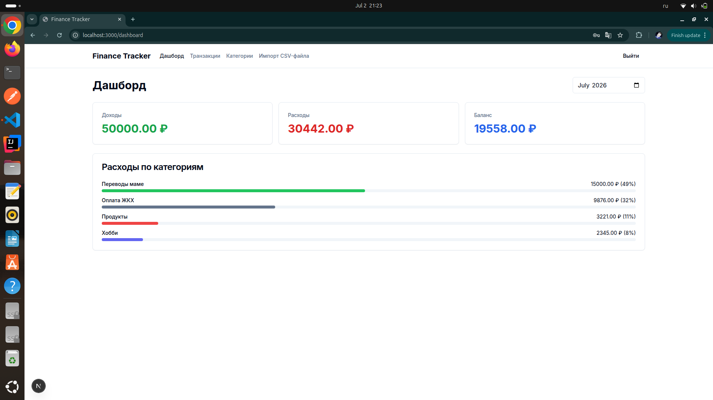
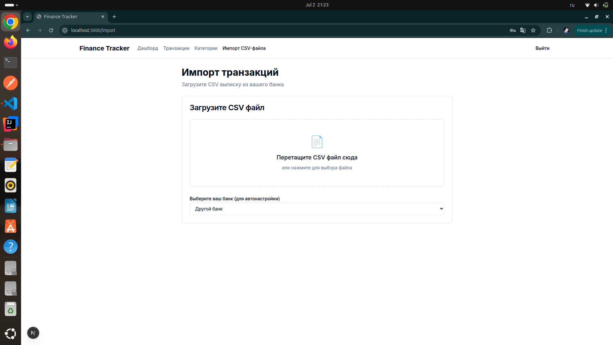
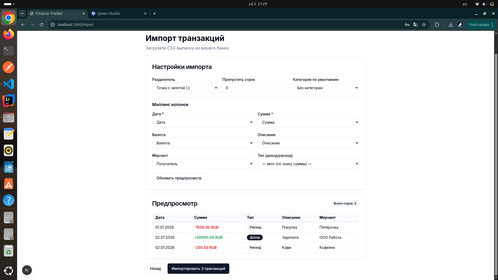
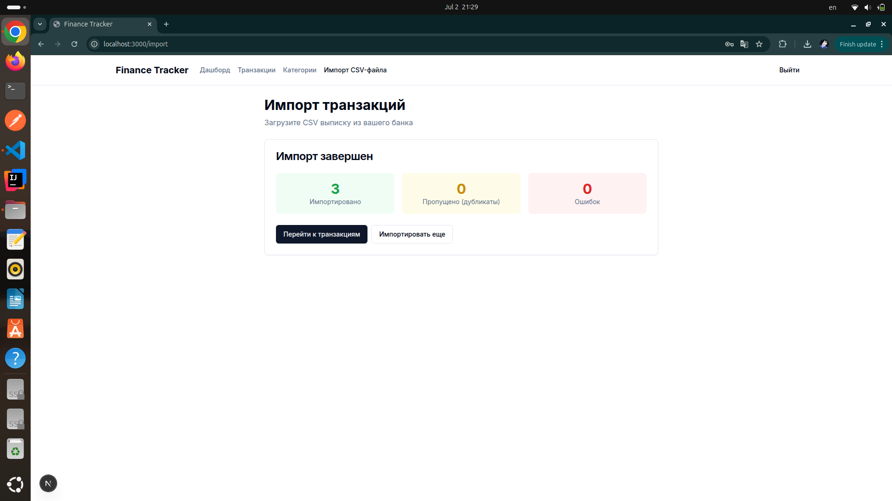

# Finance Tracker

Современное приложение для учёта личных финансов с умной категоризацией и детальной аналитикой.


## Основные возможности

### Управление финансами

- **Ручной ввод транзакций** — быстрое добавление доходов и расходов
- **Умная категоризация** — Rule Engine для автоматической классификации транзакций
- **Импорт CSV** — загрузка выписок из любых банков (Сбербанк, Тинькофф, Альфа, ВТБ)

### Аналитика и отчёты

- **Дашборд** — ключевые метрики: доходы, расходы, баланс
- **Графики расходов** — визуализация по категориям и времени
- **Сравнение периодов** — анализ динамики расходов

### Безопасность

- **Шифрование AES-256-GCM** — банковские токены защищены в БД
- **Rate limiting** — защита от DDoS атак
- **Security headers** — CSP, HSTS, XSS protection
- **OAuth 2.0** — вход через GitHub, Google, email/password

## 🛠 Технологический стек

### Frontend

- **Next.js 15** — React фреймворк с App Router и Server Components
- **React 19** — последняя версия с новыми хуками
- **TypeScript 5.9** — строгая типизация
- **Tailwind CSS** — utility-first CSS фреймворк
- **tRPC** — end-to-end типизация от API до UI
- **React Query** — управление серверным состоянием
- **Zod** — валидация схем

### Backend

- **NestJS 10** — Node.js фреймворк для воркера
- **tRPC** — type-safe API
- **Drizzle ORM** — современный ORM для TypeScript
- **PostgreSQL 16** — основная база данных
- **Redis (Upstash)** — кэширование и очереди
- **BullMQ** — обработка фоновых задач

### Инфраструктура

- **Docker** — контейнеризация
- **GitHub Actions** — CI/CD
- **Codecov** — покрытие тестами

### Тестирование

- **Vitest** — unit и integration тесты (87% покрытие)
- **Playwright** — E2E тесты

## Монорепозиторий

```bash
finance-tracker/
├── apps/
│ ├── web/ # Next.js приложение
│ └── worker/ # NestJS воркер для фоновых задач
├── packages/
│ ├── api/ # tRPC роутеры и бизнес-логика
│ ├── db/ # Drizzle ORM схемы и клиент
│ ├── ui/ # Переиспользуемые UI компоненты
│ ├── crypto/ # Утилиты шифрования
│ ├── eslint-config/ # ESLint конфигурация
│ └── typescript-config/ # TypeScript конфигурации
└── docker-compose.yml # Локальная разработка
```

## Презентация

### Страница входа в приложение



### Страница регистрации



### Компонент добавления новой категории



### Страница категорий



### Компонент добавления новой транзакции



### Страница транзакций



### Страница с данными о заработках и доходах за месяц



### Страница добавления формирования и добавления новых транзакций через парсинг выписки из банка в формате CSV



### Результат парсинга CSV файла



### Добавление новых транзакций



## Быстрый старт

### Требования

- Node.js 20+
- pnpm 9+
- Docker и Docker Compose
- PostgreSQL 16+ (или Docker)

### Установка

1. **Клонируйте репозиторий**

```bash
git clone git@github.com:YuliaVorotintseva/finance_tracker.git
cd finance-tracker
```

2. **Установите зависимости**

```bash
pnpm install
```

3. **Настройте переменные окружения**

```bash
# Скопируйте пример .env
cp apps/web/.env.example apps/web/.env
cp apps/worker/.env.example apps/worker/.env

# Сгенерируйте ключ шифрования
node -e "console.log(require('crypto').randomBytes(32).toString('hex'))"

# Добавьте ключ в оба .env файла
```

4. **Запустите базу данных**

```bash
docker-compose up -d postgres
```

5. **Примените миграции**

```bash
pnpm --filter @repo/db db:push
```

6. **Запустите приложение**

```bash
pnpm dev

# Откройте http://localhost:3000
```

## Тестирование

### Unit тесты

```bash
# Запустить все тесты
pnpm test

# С покрытием
pnpm test:coverage

# Watch mode
pnpm test:watch
```

### E2E тесты

```bash
# Запустить Playwright тесты
pnpm test:e2e

# С UI
pnpm test:e2e:ui
```

### Проверка типов и линтинг

```bash
pnpm type-check
pnpm lint
```

## Безопасность

- **Rate limiting** — защита от brute force
- **Security headers** — CSP, HSTS, X-Frame-Options
- **SQL injection protection** — параметризованные запросы
- **XSS protection** — санитизация входных данных
- **CSRF protection** — токены для форм

## Автор

**Воротинцева Юлия**

- **GitHub**: @YuliaVorotintseva
- **Email**: yulia.vorotintseva@gmail.com

## Технологии

- **Next.js** (https://nextjs.org/) — отличный fullstack фреймворк
- **NestJS** (https://nestjs.com/) — отличный backend фреймворк
- **tRPC** (https://trpc.io/) — end-to-end типизация
- **Drizzle ORM** (https://orm.drizzle.team/) — современный ORM
- **Tailwind CSS** (https://tailwindcss.com/) — utility-first CSS
